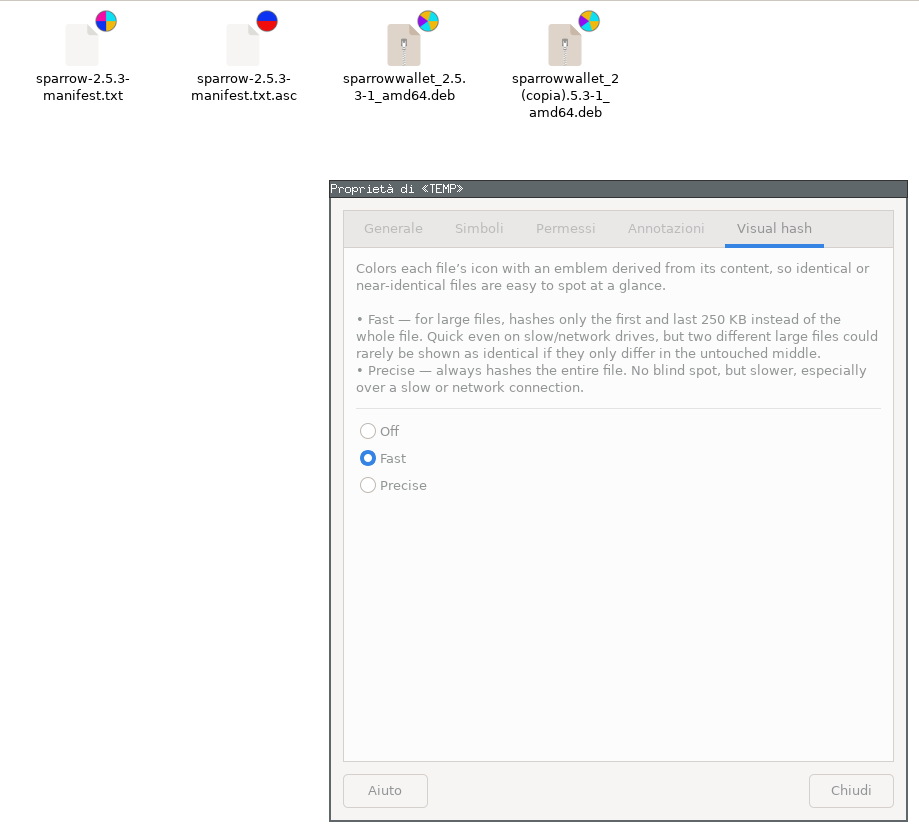

# caja-hashcolor

A Caja (MATE file manager) extension that colors each file's icon with a small
emblem derived from the file's content hash — so identical and near-identical
files are obvious at a glance, without opening, comparing or checksumming
anything by hand.



In the shot above, the two `.deb` files are byte-identical copies and get the
same emblem; the two text files differ and get their own. The emblem is picked
purely from the digest, so the same content always produces the same picture,
in any directory, on any machine.

There's no way to recolor a file's text label or row background through Caja's
extension API — emblems (small badge icons on the corner of the file icon) are
the only supported per-file visual hook, so that's what this implements.

## Features

- **Off everywhere by default.** Each directory has its own independent
  setting; enabling it in one folder affects nothing else, not even its
  subfolders.
- **Two modes.** *Fast* samples large files, *Precise* always reads them whole.
- **480 distinct emblems** — solid colors plus 2/3/4/5/6-color band and pie
  layouts, from a hand-tuned 7-hue palette, every one equally likely.
- **Never blocks the file manager.** Hashing runs on GIO async I/O, one file at
  a time, and is cancelled when you navigate away.
- **Results are cached** in SQLite and invalidated on size/mtime change, so a
  directory is only slow the first time.

Sample emblems:     

## Requirements

- `caja` and `python3-caja` — the Caja GObject-introspection bindings. The
  package is usually called `python3-caja` on Debian/Ubuntu/Mint and
  `caja-python` or `python-caja` elsewhere.
- `python3-gi` and the GTK 3 typelib (`gir1.2-gtk-3.0` on Debian/Ubuntu).
- Python 3.10 or newer.

Nothing else. Pillow is **not** required: all emblems are committed to the
repository already, and `generate_emblems.py` (the only thing that needs it) is
a development tool.

## Install

```
git clone https://github.com/inaltoasinistra/caja-hashcolor.git
cd caja-hashcolor
make install     # for the current user, into ~/.local
caja -q          # Caja restarts on its own the next time you open a folder
```

Use `sudo make install` instead to install system-wide into `/usr` for every
user on the machine. `make install PREFIX=/opt/somewhere` overrides the prefix,
and `make install DESTDIR=/build/root` stages the files without touching the
live system, for building a distro package.

`caja -q` quits every Caja window and process — it's a single process serving
all of them — and the extension is only picked up on the next start.

## Uninstall

```
make uninstall       # or `sudo make uninstall` if you installed system-wide
caja -q
```

That removes the extension and its emblems. Your own settings and the digest
cache are left alone; delete them by hand if you want them gone:

```
rm -rf ~/.config/caja-hashcolor ~/.cache/caja-hashcolor
```

## Usage

Right-click any single file or folder and choose **Properties**. The dialog has
a **Visual hash** tab (see the screenshot above) with three radio buttons:

- **Off** / **Fast** / **Precise** — see below for the difference between the
  two active modes. Selecting one applies it *to the current directory only*
  (the tab shows whichever is currently active when it opens).

Each directory remembers its own setting independently - enabling it in one
folder has no effect on any other folder, including its own subfolders.

Toggling a directory's setting immediately re-colors every file from that
directory this extension has already seen this session (via
`Caja.FileInfo.invalidate_extension_info()`) - no manual refresh needed for
those. A file that's never yet been displayed just picks up the directory's
current setting the first time it's shown.

A file whose hash isn't cached yet shows a temporary "synchronizing" emblem
the moment its hash actually starts running, replaced by the real color once
it finishes. Only one file is ever hashed at a time (see below); every other
file still waiting its turn shows a neutral placeholder instead - never the
"synchronizing" emblem (that's reserved for whichever file is genuinely being
worked on right now) and never a stale color left over from before (e.g. a
different mode's cached result). This matters most when switching a
directory with many large files to Precise mode: without this distinction,
every file needing a rehash would show "synchronizing" (or worse, keep
showing its old Fast-mode color) for however long it takes to work through
the rest of the queue, even though only one is actually being hashed.

## Hash modes

- **Fast** (default): files ≤ 1MB get a full SHA-256 hash; larger files are
  hashed from their first 250KB, last 250KB, and the file size - no middle
  sampling. Two large files differing only somewhere in between will collide
  to the same color (the documented trade-off). Deliberately head/tail-only,
  not scattered small samples across the whole file: a fixed byte budget
  becomes a vanishing fraction of a large file, so scattered sampling is a
  weak bet, while real formats concentrate the content most likely to change
  at the boundaries - archive/container indices at the end, EXIF/XMP/thumbnail
  metadata at the start, interrupted-write corruption typically hitting the
  tail.
- **Precise**: always hashes the entire file, regardless of size. No sampling
  collisions, but reading a large file - especially over a network mount -
  takes real time no matter how it's read; the async design keeps Caja's UI
  responsive while that happens, it doesn't make the read itself faster.

Digests are cached in `~/.cache/caja-hashcolor/cache.db` (SQLite), keyed by
`(path, mode)` and invalidated on size/mtime change, since Fast and Precise
disagree on large files and must never share a cached digest. If that file
gets deleted (e.g. to reset the cache) the extension transparently reconnects
and recreates it on the next hash - no restart needed.

Per-directory settings live in `~/.config/caja-hashcolor/config.json` as two
plain path lists, `fast_dirs` and `precise_dirs` (a directory is in at most
one of the two). Directories that no longer exist are pruned from both lists
once per Caja session, alongside the equivalent cache cleanup for deleted
files, so the lists don't grow forever as directories come and go.

## Where things live

| What                 | User install (`make install`)            | System install (`sudo make install`) |
|----------------------|------------------------------------------|--------------------------------------|
| Extension            | `~/.local/share/caja-python/extensions/` | `/usr/share/caja-python/extensions/` |
| Emblems              | `~/.local/share/caja-hashcolor/emblems/` | `/usr/share/caja-hashcolor/emblems/` |
| Per-directory config | `~/.config/caja-hashcolor/config.json`   | same (per user)                      |
| Digest cache         | `~/.cache/caja-hashcolor/cache.db`       | same (per user)                      |

`hash_color.py` is the only module Caja loads as an extension; everything else
lives in the `caja_hashcolor` package next to it. That matters because
caja-python inserts the extensions directory at `sys.path[0]` and imports every
top-level `.py` it finds there — flat modules named `config` or `hashing` would
be visible to, and could shadow imports in, every other extension on the
system.

The emblems deliberately go in a private directory rather than into
`share/icons/hicolor/32x32/emblems/`. Caja's manual emblem chooser (the
**Emblems** tab of the Properties dialog) lists the icon theme's `Emblems`
context, so installing there would add 480 hash colors to a list of about
thirty — and a hash color means nothing when you pick it by hand. Registering
the directory with `Gtk.IconTheme.append_search_path()` instead makes the
emblems *unthemed*: resolvable by name, invisible to that list.

## Development

```
make test      # unit tests, no Caja process needed
make link      # symlink install, so edits are live after `caja -q`
make emblems   # re-render emblems/ after changing palette.py (needs Pillow)
caja -q        # Caja does not hot-reload; restart it after *any* change
```

After `make emblems`, run `make install-emblems` to copy the new files into the
icon theme (`make link` does that too), then restart Caja. A running Caja can
keep serving icon lookups from what the icon theme had already scanned, so a
freshly added emblem name may otherwise render as a missing icon.

## License

MIT - see [LICENSE](LICENSE).

## Design notes

- **GIO async I/O, not a background thread.** Caja's documented way to avoid
  blocking its UI on slow work is `update_file_info_full()` returning
  `Caja.OperationResult.IN_PROGRESS` and completing later from a background
  thread. In practice, spawning a real OS thread from inside a live Caja
  process hangs after its first blocking call (reproduced with a trivial
  sleep loop that made no Caja API calls at all, while the same thread ran
  fine standalone and inside a bare `Gtk.main()` loop) - `caja-python`'s C
  bridge doesn't appear to keep the GIL available to threads it didn't spawn
  itself. Reading the whole file in one plain synchronous call avoided the
  hang but blocked Caja's UI, badly so on a network mount where a single
  `read()` can itself take real time. `hashing.AsyncFullHash` reads the file
  using `Gio.File.read_async()` / `GFileInputStream.read_bytes_async()`
  instead: the actual I/O happens inside GIO's own machinery, never inside a
  thread this extension spawns, and every chunk's completion is delivered as
  a normal main-loop callback - so Caja's UI is never blocked, without a
  second thread ever existing.
- **One file hashed at a time (`hashing.SerialQueue`).** Even with async I/O,
  opening a directory full of large network files would otherwise start many
  concurrent read chains at once, all competing for the main loop's attention
  together - which can feel just as sluggish as a single blocking call, only
  spread out. Every hash job is submitted to a `SerialQueue` instead: only one
  file's read is ever in flight, the rest wait their turn. Known trade-off:
  switching a directory with many large files (e.g. a media library) to
  Precise mode queues a full-content hash of every file, one at a time - for
  a genuinely huge directory this can take a long time to fully recolor,
  since nothing speeds that up beyond how fast one file at a time can be read.
- **Cancellation.** An in-progress or queued hash is aborted, not left to run
  to completion uselessly, when either Caja says it's no longer needed
  (`cancel_update()` - e.g. the user navigated to a different directory) or
  that directory's setting changes mid-hash (`_cancel_pending_for_directory()`
  - scoped to just that directory's in-flight/queued handles, tracked via
  `_handle_paths`, so changing one directory's setting doesn't touch hashing
  in progress for any other). A hash that finishes anyway before its
  cancellation is noticed re-checks the directory's live setting before
  adding an emblem, so a stale completion can't sneak a color back on after
  that directory's setting has changed.
- **"Synchronizing" progress emblem, and never showing it for the wrong
  file.** Caja's extension API has no way to *remove* an emblem, only add
  one, and `update_file_info_full()` always resolves synchronously (never
  returns `IN_PROGRESS`) - every call shows whatever's true *right now* and
  queues the real hash in the background. `_path_handles` (path -> the one
  handle currently queued or running for it) is what makes that safe: a file
  shows the "synchronizing" emblem only while its own hash is the one
  actually running (`handle in _operations`), a neutral cleared placeholder
  while merely queued behind another file, and the real color once cached -
  never the *previous* mode's stale color, and never "synchronizing" for a
  file that isn't genuinely being worked on. When the background hash
  changes state (starts running, or finishes), it calls
  `file.invalidate_extension_info()` to prompt Caja to ask again; the dedup
  check against `_path_handles` stops that fresh call from queuing a second,
  redundant hash for the same path. Two earlier, narrower bugs led here: first,
  adding both the computing emblem and the real color within the same
  still-open cycle left the computing emblem stuck forever (Caja has no way
  to know the cycle should be superseded); fixed by never doing that, always
  resolving a cycle with exactly one emblem. Second, showing the computing
  emblem synchronously for *every* file needing a rehash (regardless of
  whether the queue had actually reached it yet) meant switching a directory
  with many files to Precise mode showed "synchronizing" on all of them at
  once, even though only one hash was really running - fixed by the
  `_path_handles` active/queued distinction above.
- **Clearing emblems on disable.** For the same reason - no "remove emblem"
  call - a cycle that adds nothing at all leaves a previous color exactly
  where it was, so simply skipping `add_emblem()` when a directory is
  disabled doesn't clear the stale color. `palette.CLEAR_EMBLEM_NAME` is a
  fully transparent image added explicitly whenever a directory's mode is
  `None`: the cycle still adds *something*, which replaces the prior state,
  but nothing visible actually renders.
- **Directory path normalization.** The directory string used for config
  lookups gets derived three different ways depending on which Caja callback
  is asking - a folder's own location, a file's parent location, or
  `os.path.dirname()` of a file's path. Without normalizing all three with
  `os.path.normpath()`, a trailing slash or redundant path segment could make
  what's logically the same directory compare unequal between them, silently
  losing/hiding a setting written under one form when looked up under
  another (the intermittent "checkmark sometimes lost" symptom).
- **Config write robustness.** `config.save_config()` writes to a temp file
  and atomically renames it into place, so a crash or kill mid-write (e.g.
  during Caja restart cycles while developing/testing) can never leave
  `config.json` truncated. `load_config()` also treats a corrupt/unreadable
  file as "no settings" rather than raising, in case corruption ever happens
  anyway.
- **Palette**: 7 explicit (not evenly-spaced) hues at full saturation/mid
  lightness - no need to bias toward light colors, unlike a text background,
  since nothing is drawn on top of an emblem. Hues are hand-placed, not a
  uniform wheel, because raw hue-degree distance doesn't track perceived
  difference (an earlier evenly-spaced attempt put chartreuse/green next to
  cyan, which read as near-identical despite clearing the angular threshold).
  Combinations are filtered by a minimum hue-distance rule, with an
  adjacency-only relaxation for the two 4-slice pie styles (only slices that
  actually touch need to contrast). See `palette.py`'s module docstring-style
  comments and `test_palette.py` for the exact rules and their regression
  tests.
